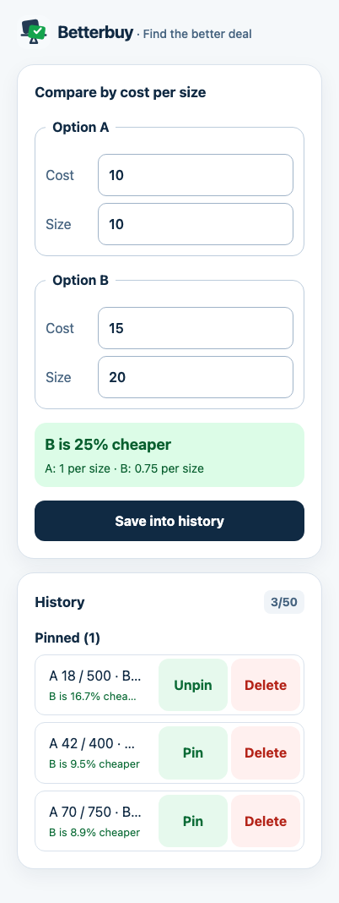

# Betterbuy

## Find the better deal in seconds

Compare two offers by cost per comparable size and immediately see which one gives you more for your money. Betterbuy is private, local-first, and works offline.



## Install Betterbuy on iPhone

1. Open Betterbuy in Chrome on your iPhone.
2. Tap the **Share** icon (the square with an upward arrow).
3. Scroll down and tap **Add to Home Screen**.
4. Optionally rename the app, then tap **Add**.

Betterbuy will appear on your Home Screen and open like a native app. If **Add to Home Screen** is unavailable in Chrome, update Chrome or use Safari and follow the same steps.

## Development

```sh
npm install
npm run dev
```

The app uses React with a small Zustand reducer store. See
[Zustand DevTools time travel](docs/zustand-devtools.md) for the development
debugging workflow and its persistence boundaries.

## Storybook

The calculator uses Tailwind CSS with Betterbuy theme utilities. Use Storybook
to review documented component states and run their interaction tests.

```sh
npm run storybook
npm run test:storybook
```

## Checks

```sh
npm run typecheck
npm test
npm run test:coverage
npm run build
npm run test:e2e
```

## PWA updates

Betterbuy uses `vite-plugin-pwa` to generate a revisioned service worker from
Vite's final hashed HTML, JavaScript, CSS, and install assets. This keeps the
cached HTML shell and its referenced assets version-matched after a deployment,
instead of leaving installed users on a static service worker that does not
change with ordinary application builds.

The PWA manifest and service-worker generation are configured in Vite; React
handles runtime registration and the update UI. Updates download in the
background and apply only after the user selects **Update now**, so a draft
comparison is not interrupted.

## Privacy and saved comparisons

Enter offers using comparable sizes—Betterbuy does not convert units or collect data. Saved comparisons stay in local browser storage, can be restored, pinned or unpinned (up to 5 pins), or deleted, and are capped at 50 entries.
